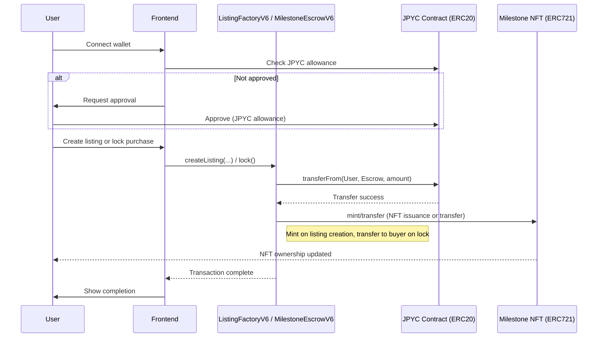
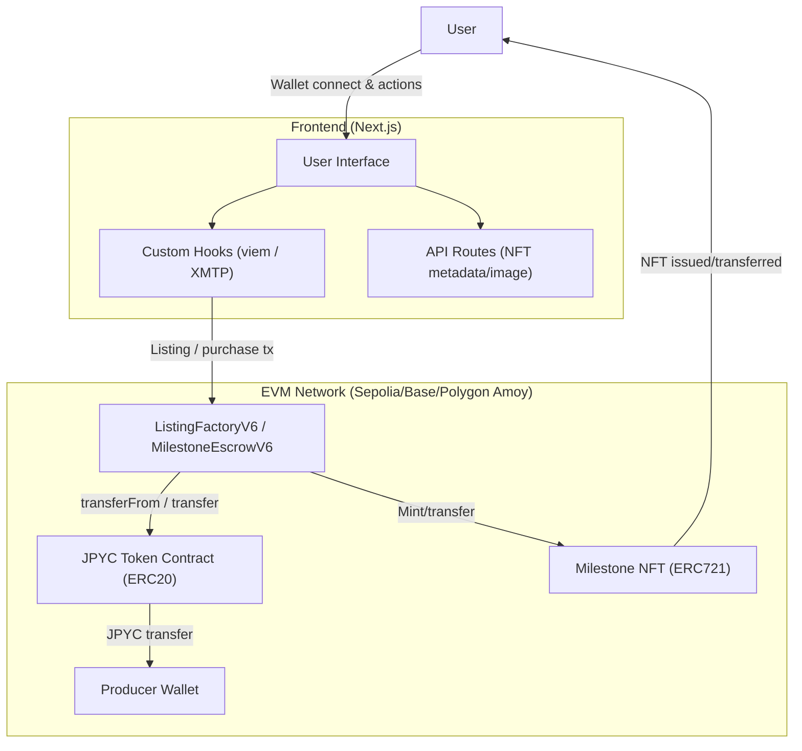

# Wagyu Milestone Escrow

[](./README.md)
[](./README.en.md)


A milestone-based escrow DApp for Wagyu, sake, and craft listings.
Each listing deploys a `MilestoneEscrowV6` and an ERC721 NFT via `ListingFactoryV6`, and the NFT is transferred to the buyer after lock.
Progress is reflected on-chain and surfaced via Dynamic NFT metadata and XMTP chat.

## Features

- Deploys a per-listing `MilestoneEscrowV6` and mints an ERC721 NFT
- State transitions `open → locked → active → completed/cancelled` with buyer approval (`approve()`)
- ERC20 transfer on `lock()` plus milestone-based partial releases and final delivery confirmation
- Dynamic NFT metadata/SVG image API (`/api/nft/:tokenId`)
- XMTP chat and bilingual UI (JA/EN) with MetaMask integration

## Requirements

- Node.js (for the Next.js app)
- MetaMask (wallet connection)
- RPC endpoint (supported: Sepolia / Base Sepolia / Base / Polygon Amoy)
- Deployed ListingFactoryV6 and ERC20 token addresses
- XMTP network (for chat)
- Foundry + Solidity 0.8.24 (if you build contracts)

## Installation

```bash
# Example (npm)
cd apps/web
npm install
```

## Quick Start

1. Go to `apps/web`
2. Copy `.env.example` to `.env.local`
3. Set required values such as `NEXT_PUBLIC_FACTORY_ADDRESS`
4. Run `npm run dev`
5. Open `http://localhost:3000`

## Usage

### App

1. Producer connects wallet and creates a listing with category, title, price, and image URL
2. Buyer approves the ERC20 allowance and runs `lock()` (purchase lock)
3. Buyer calls `approve()` to start the milestones (`locked → active`)
4. Producer submits milestones in order and releases funds step by step
5. While LOCKED, buyer can `cancel()` for refund; final step is `confirmDelivery()`

### Dynamic NFT API

- Metadata: `GET /api/nft/:tokenId`
- Image: `GET /api/nft/:tokenId/image`

The API resolves escrow via `ListingFactoryV6.tokenIdToEscrow`.
Set `ListingFactoryV6.baseURI` to your app origin (e.g., `https://your-app`).

### XMTP Chat

- Participants: the producer and the current NFT owner
- Visible when `status` is not `open` / `cancelled`, and user is producer or NFT owner
- Connection/signing: MetaMask `personal_sign` to create the XMTP client
- History: encryption key stored at `localStorage` key `xmtp_db_key_<address>`
- Environment: production only when `NEXT_PUBLIC_XMTP_ENV=production`

### Smart Contract Deployment (Example)

1. Deploy `contracts/MockERC20.sol` (for testing)
2. Deploy `ListingFactoryV6` from `contracts/ListingFactoryV6.sol`
   - `tokenAddress`: ERC20 token address
   - `uri`: app origin (used by `/api/nft/:tokenId`)
3. Use the app to call `createListing` (auto-deploys `MilestoneEscrowV6`)

## User Flow 



## System Architecture 



## Directory Structure

```
hackson/
├── apps/
│   └── web/                    # Next.js app
│       ├── src/app/             # App Router UI + API routes
│       ├── src/components/      # UI components
│       ├── src/hooks/           # Client hooks (XMTP, etc.)
│       ├── src/lib/             # viem/xmtp/config/i18n/ABI
│       ├── .env.example         # Environment template
│       └── package.json
├── contracts/                   # Solidity smart contracts
│   ├── ListingFactoryV6.sol     # Factory + MilestoneEscrowV6 (current)
│   ├── ListingFactoryV5.sol     # Legacy
│   └── MockERC20.sol            # Test ERC20
├── lib/                          # OpenZeppelin contracts (vendor)
├── foundry.toml
└── LICENSE
```

## Configuration

`apps/web/.env.local`

```
NEXT_PUBLIC_RPC_URL=
NEXT_PUBLIC_CHAIN_ID=11155111
NEXT_PUBLIC_FACTORY_ADDRESS=
NEXT_PUBLIC_TOKEN_ADDRESS=
NEXT_PUBLIC_BLOCK_EXPLORER_TX_BASE=
NEXT_PUBLIC_XMTP_ENV=dev

# Optional (server-side override for API routes)
CHAIN_ID=

# Optional (legacy, not used by current UI)
NEXT_PUBLIC_CONTRACT_ADDRESS=
```

- `NEXT_PUBLIC_RPC_URL`: RPC URL for the target network
- `NEXT_PUBLIC_CHAIN_ID`: Chain ID (supported: Sepolia / Base Sepolia / Base / Polygon Amoy)
- `NEXT_PUBLIC_FACTORY_ADDRESS`: `ListingFactoryV6` address (required for UI/API)
- `NEXT_PUBLIC_TOKEN_ADDRESS`: ERC20 token address
- `NEXT_PUBLIC_BLOCK_EXPLORER_TX_BASE`: Base URL for tx links (optional)
- `NEXT_PUBLIC_XMTP_ENV`: XMTP environment (`dev` or `production`)
- `CHAIN_ID`: Chain ID override for API routes (optional)
- `NEXT_PUBLIC_CONTRACT_ADDRESS`: Legacy config (unused by current UI)

## Development

```bash
cd apps/web
npm run dev
npm run dev:turbo
npm run build
npm run start
npm run lint
```

## License

MIT License. See `LICENSE`.
