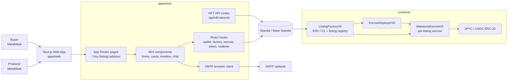
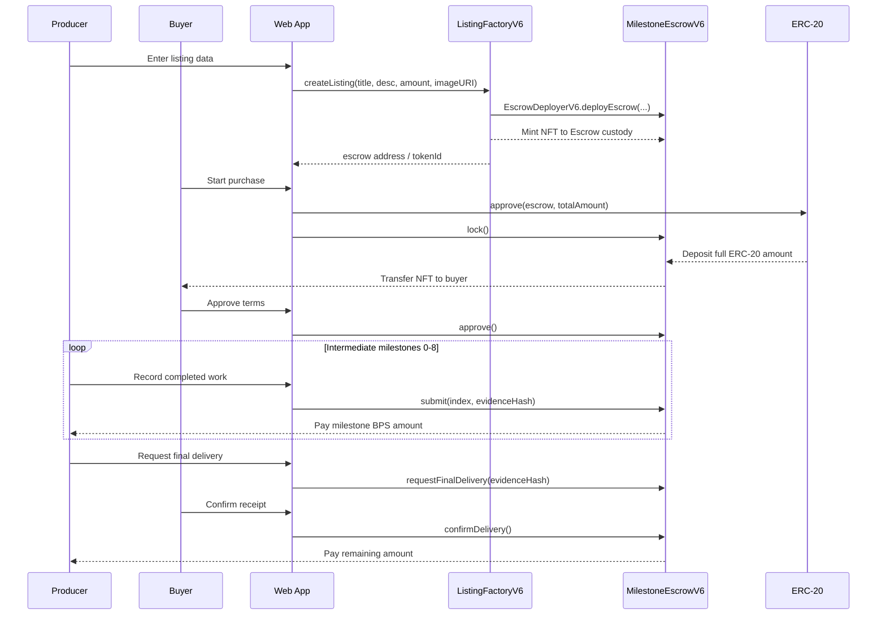
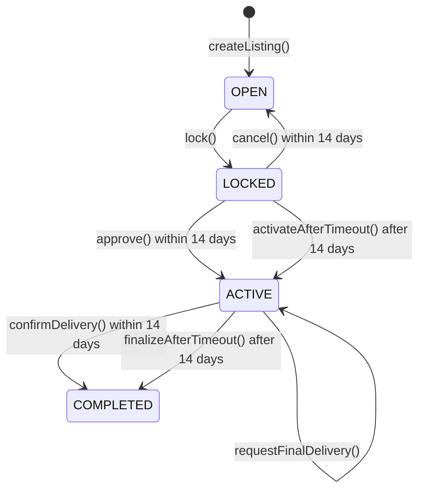
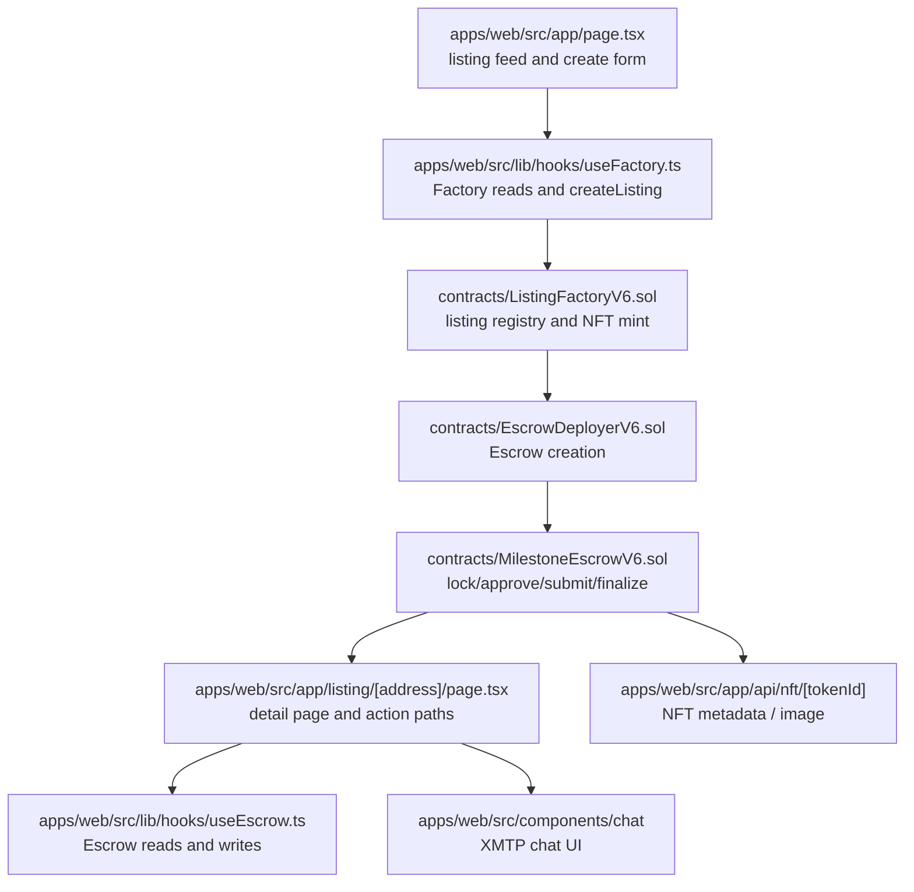

# Proof of Trust

[](README.md)
[](apps/web/Dockerfile)
[](foundry.toml)
[](LICENSE)

> A milestone escrow DApp for high-value B2B trade, combining staged payouts, dynamic NFTs, and party-to-party chat.

`Proof of Trust` targets long production-cycle trades such as wagyu, where buyers and producers can run into prepayment risk, poor progress visibility, and delayed delivery confirmation. The buyer deposits ERC-20 funds into escrow, the producer receives payouts as milestones complete, and the NFT acts as a stateful ownership certificate for the transaction.

## What It Does

- Creates a dedicated escrow per listing using JPYC / USDC testnet ERC-20
- Lets the buyer lock the full amount, then start the milestone flow after review
- Lets the producer complete 9 intermediate milestones with `submit()`, then finish the final delivery through buyer confirmation or timeout
- Mints an ERC-721 NFT per listing and serves dynamic metadata plus SVG image APIs
- Provides listing, workspace, detail, and on-chain event timeline screens
- Provides XMTP chat for the producer and current NFT holder
- Uses Foundry tests for relisting, deadlines, final delivery, and fee-token rejection

## Architecture



## Transaction Flow



## State Machine



State meanings:

| State | UI label | Meaning |
| --- | --- | --- |
| `open` | Available | The NFT is held by escrow and no buyer is committed yet |
| `locked` | Under Review | The buyer has deposited the full amount and holds the NFT |
| `active` | In Progress | Milestone payouts can be released to the producer |
| `completed` | Completed | All payouts are complete |

## Code Reading Path



## Repository Structure

```text
.
├── apps/web/                 Next.js 15 + React 19 DApp
│   ├── src/app/              App Router pages and NFT API routes
│   ├── src/components/       UI parts, transaction actions, chat UI
│   ├── src/hooks/            XMTP chat hook
│   └── src/lib/              ABI, config, viem hooks, tx utilities
├── contracts/                Solidity contracts
│   ├── ListingFactoryV6.sol  ERC-721 NFT + listing registry
│   ├── EscrowDeployerV6.sol  Escrow creation helper
│   ├── MilestoneEscrowV6.sol Per-listing escrow core
│   └── MockERC20.sol         ERC-20 for Foundry tests
├── script/                   Foundry deploy script
├── test/                     Foundry tests
├── lib/                      OpenZeppelin submodule
└── foundry.toml              Foundry config
```

## Prerequisites

- Node.js 20+
- `pnpm`
- Foundry, if you build or test contracts
- MetaMask
- RPC URL for Sepolia or Base Sepolia
- JPYC / USDC-compatible ERC-20 addresses

Supported chains are defined in `apps/web/src/lib/config.ts`.

| Chain | Chain ID |
| --- | --- |
| Sepolia | `11155111` |
| Base Sepolia | `84532` |

## Installation

```bash
pnpm --dir apps/web install
git submodule update --init --recursive
```

## Quick Start

```bash
cp apps/web/.env.example apps/web/.env.local
pnpm --dir apps/web dev
```

Open `http://localhost:3000`.

## Configuration

The app reads `apps/web/.env.local`. Use `apps/web/.env.example` as the template.

| Variable | Required | Description |
| --- | --- | --- |
| `NEXT_PUBLIC_RPC_URL` | Yes | Target RPC URL |
| `NEXT_PUBLIC_CHAIN_ID` | Yes | `11155111` or `84532` |
| `NEXT_PUBLIC_JPYC_FACTORY_ADDRESS` | Yes | JPYC `ListingFactoryV6` |
| `NEXT_PUBLIC_JPYC_TOKEN_ADDRESS` | Yes | JPYC ERC-20 |
| `NEXT_PUBLIC_USDC_FACTORY_ADDRESS` | Yes | USDC `ListingFactoryV6` |
| `NEXT_PUBLIC_USDC_TOKEN_ADDRESS` | Yes | USDC ERC-20 |
| `NEXT_PUBLIC_BLOCK_EXPLORER_TX_BASE` | No | Base URL for transaction links |
| `NEXT_PUBLIC_XMTP_ENV` | No | `dev` or `production` |
| `CHAIN_ID` | No | Chain override for API routes |

## Smart Contracts

### `ListingFactoryV6`

- Uses a `1 factory = 1 stablecoin` model
- Verifies that `tokenAddress` is one of the JPYC / USDC allowlisted tokens
- Creates an escrow and mints the NFT to escrow custody in `createListing()`
- Returns `/api/nft/:tokenId?factoryAddress=...` from `tokenURI()`
- Restricts normal secondary transfer and allows only escrow-driven NFT transfers

### `MilestoneEscrowV6`

- `lock()` deposits the buyer's full ERC-20 amount and transfers the NFT to the buyer
- `approve()` or `activateAfterTimeout()` starts the active transaction
- `submit(index, evidenceHash)` completes intermediate milestones in order
- `requestFinalDelivery()` starts the final confirmation window
- `confirmDelivery()` or `finalizeAfterTimeout()` releases the remaining amount
- `cancel()` is only available in `locked` within 14 days, refunds the buyer, and reopens the listing
- Token transfers verify exact received/spent amounts, rejecting fee-on-transfer behavior

### Milestone Distribution

`MilestoneEscrowV6` and `apps/web/src/lib/constants.ts` currently model a 10-step wagyu transaction.

| Index | Milestone | BPS | Payout |
| --- | --- | ---: | ---: |
| 0 | Calf purchase | 200 | 2.0% |
| 1 | Feeding start | 300 | 3.0% |
| 2 | Weight 100kg | 400 | 4.0% |
| 3 | Weight 200kg | 500 | 5.0% |
| 4 | Weight 300kg | 600 | 6.0% |
| 5 | Weight 400kg | 650 | 6.5% |
| 6 | Weight 500kg | 700 | 7.0% |
| 7 | Shipment prep | 750 | 7.5% |
| 8 | Shipment | 900 | 9.0% |
| 9 | Delivery complete | 5000 | 50.0% |

## Web App

| Path | Purpose |
| --- | --- |
| `/` | Listing feed, listing creation, producer task summary |
| `/my` | Producer/buyer workspace list |
| `/listing/:address` | Escrow detail, payment actions, milestone recording, event timeline, chat |
| `/api/nft/:tokenId` | NFT metadata JSON |
| `/api/nft/:tokenId/image` | Dynamic SVG image |

Core hooks:

| File | Purpose |
| --- | --- |
| `apps/web/src/lib/hooks/useWallet.ts` | MetaMask connection and account state |
| `apps/web/src/lib/hooks/useFactory.ts` | Factory reads and listing creation |
| `apps/web/src/lib/hooks/useEscrow.ts` | Escrow reads, writes, and event history |
| `apps/web/src/lib/hooks/useToken.ts` | ERC-20 balance and allowance checks |
| `apps/web/src/lib/hooks/useRealtime.ts` | Refetch helpers for workspace and escrow state |
| `apps/web/src/hooks/useXmtpChat.ts` | XMTP connection, conversation loading, sending, and recovery |

## Development

```bash
pnpm --dir apps/web dev
pnpm --dir apps/web dev:turbo
pnpm --dir apps/web build
pnpm --dir apps/web start
pnpm --dir apps/web lint
pnpm --dir apps/web test
```

Contracts:

```bash
forge build
forge test
```

## Testnet Deployment

`ListingFactoryV6` follows `1 factory = 1 stablecoin`. Deploy one factory for JPYC and one factory for USDC on the same testnet.

1. Set environment variables

```bash
export TESTNET_RPC_URL="https://your-testnet-rpc"
export PRIVATE_KEY="0x..."
export JPYC_TOKEN_ADDRESS="0xYourJpycTokenAddress"
export USDC_TOKEN_ADDRESS="0xYourUsdcTokenAddress"
export BASE_URI="https://your-app.example.com"
```

2. Deploy the JPYC factory

```bash
export TOKEN_ADDRESS="$JPYC_TOKEN_ADDRESS"
forge script script/DeployListingFactoryV6.s.sol:DeployListingFactoryV6 \
  --rpc-url "$TESTNET_RPC_URL" \
  --broadcast
```

3. Deploy the USDC factory

```bash
export TOKEN_ADDRESS="$USDC_TOKEN_ADDRESS"
forge script script/DeployListingFactoryV6.s.sol:DeployListingFactoryV6 \
  --rpc-url "$TESTNET_RPC_URL" \
  --broadcast
```

4. Configure deployed addresses in `apps/web/.env.local`

```bash
NEXT_PUBLIC_RPC_URL=https://your-testnet-rpc
NEXT_PUBLIC_CHAIN_ID=84532
NEXT_PUBLIC_JPYC_FACTORY_ADDRESS=0xYourJpycFactoryAddress
NEXT_PUBLIC_JPYC_TOKEN_ADDRESS=0xYourJpycTokenAddress
NEXT_PUBLIC_USDC_FACTORY_ADDRESS=0xYourUsdcFactoryAddress
NEXT_PUBLIC_USDC_TOKEN_ADDRESS=0xYourUsdcTokenAddress
NEXT_PUBLIC_XMTP_ENV=dev
```

## Test Coverage

- NFT is minted to escrow custody when the factory creates a listing
- Unsupported stablecoin configuration is rejected
- `cancel()` reopens the listing, refunds the buyer, and returns NFT custody to escrow
- Producer self-purchase is rejected
- The 14-day `locked` deadline and timeout activation paths work
- The final delivery 14-day confirmation window and timeout completion paths work
- Fee-on-transfer and sender-paid-fee ERC-20 behavior is rejected
- `formatAmount()` formats JPYC/USDC decimal display correctly

## Related Files

- `docs/planidea.md`
- `TODOS.md`
- `apps/web/.env.example`
- `script/DeployListingFactoryV6.s.sol`

## License

MIT License. See `LICENSE`.
