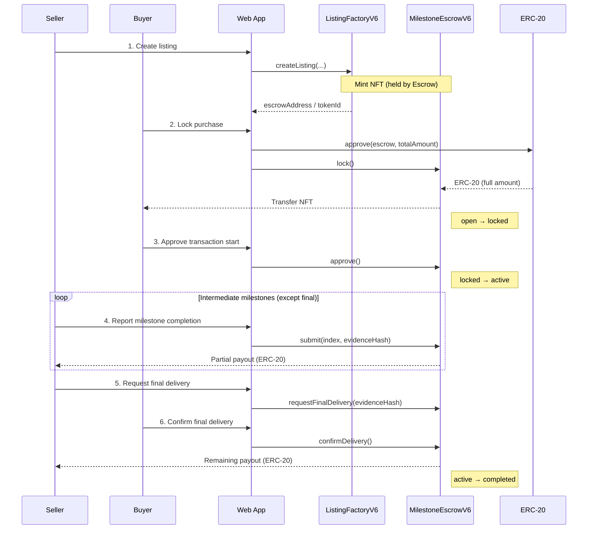

# Proof of Trust

[](README.md)
[](apps/web/Dockerfile)
[](foundry.toml)
[](LICENSE)

> A milestone-based escrow DApp for high-value B2B trade, combining staged payouts, dynamic NFTs, and party-to-party encrypted chat.

## Overview

`Proof of Trust` is designed for long production-cycle wagyu transactions, where prepayment risk and progress visibility are major concerns.

- Web app: Next.js 15 + React 19 + viem
- Contracts: `ListingFactoryV6` / `MilestoneEscrowV6` (Solidity 0.8.24)
- Settlement: JPYC / USDC testnet ERC-20
- Ownership proof: ERC-721 (dynamic metadata / SVG)
- Chat: XMTP (E2E encrypted)

## Main Transaction Sequence (Mermaid)



Notes:
- `cancel()` is buyer-only in `locked`, refunds the full amount, returns the NFT to escrow custody, and reopens the listing.
- After 14 days in `locked`, anyone can call `activateAfterTimeout()` to move the listing to `active`.
- After 14 days from `requestFinalDelivery()`, anyone can call `finalizeAfterTimeout()` to release the remaining payout.

## Key Features

- Deploys a dedicated `MilestoneEscrowV6` per listing and mints a linked NFT
- State transitions
  - `open -> locked -> active -> completed`
  - `locked -> open` (via `cancel()`, ready for relisting)
- Buyer deposits ERC-20 via `lock()`, then starts milestone flow with `approve()` or `activateAfterTimeout()`
- Producer reports intermediate milestones via `submit()`; the final step uses `requestFinalDelivery()` -> `confirmDelivery()` / `finalizeAfterTimeout()`
- Listing detail page renders on-chain event timeline
- NFT APIs
  - `GET /api/nft/:tokenId` (metadata)
  - `GET /api/nft/:tokenId/image` (dynamic SVG)
- XMTP chat (shown only to producer and current NFT holder)

## Repository Structure

```text
apps/web/    Next.js 15 frontend + API routes
contracts/   Solidity contracts (Factory/Escrow/MockERC20)
docs/        Architecture, demo script, and demo assets
lib/         Foundry libraries (OpenZeppelin submodule)
```

## Prerequisites

- Node.js 20+
- `pnpm`
- MetaMask
- RPC URL for your target chain
- Deployed contract addresses
  - `ListingFactoryV6`
  - settlement ERC-20 token

Supported chains (`apps/web/src/lib/config.ts`):

- Sepolia (`11155111`)
- Base Sepolia (`84532`)

If you build contracts with Foundry, initialize submodules first.

```bash
git submodule update --init --recursive
```

## Installation

```bash
pnpm --dir apps/web install
```

## Quick Start

```bash
cp apps/web/.env.example apps/web/.env.local
pnpm --dir apps/web dev
```

Open `http://localhost:3000`.

## Configuration (`.env.local`)

Config file: `apps/web/.env.local`

### Required (Core DApp)

| Variable | Description |
| --- | --- |
| `NEXT_PUBLIC_RPC_URL` | Target RPC URL |
| `NEXT_PUBLIC_CHAIN_ID` | Chain ID |
| `NEXT_PUBLIC_JPYC_FACTORY_ADDRESS` | JPYC `ListingFactoryV6` address |
| `NEXT_PUBLIC_JPYC_TOKEN_ADDRESS` | JPYC ERC-20 address |
| `NEXT_PUBLIC_USDC_FACTORY_ADDRESS` | USDC `ListingFactoryV6` address |
| `NEXT_PUBLIC_USDC_TOKEN_ADDRESS` | USDC ERC-20 address |

### Optional (Display / Runtime)

| Variable | Description |
| --- | --- |
| `NEXT_PUBLIC_BLOCK_EXPLORER_TX_BASE` | Base URL for tx links |
| `CHAIN_ID` | API-side chain override |
| `NEXT_PUBLIC_XMTP_ENV` | `dev` or `production` |

## Smart Contract Design (V6)

### Factory

- `ListingFactoryV6.createListing(...)` deploys a new escrow
- NFT is initially owned by escrow
- Secondary transfer is restricted to escrow-driven flows

### Escrow

- `lock()`
  - Buyer deposits ERC-20
  - NFT moves to buyer
  - `open -> locked`
- `approve()`
  - Buyer starts the transaction within the review window
  - `locked -> active`
- `activateAfterTimeout()`
  - Callable by anyone after 14 days in `locked`
  - `locked -> active`
- `submit(index, evidenceHash)`
  - Producer reports intermediate milestone completion
- `requestFinalDelivery(evidenceHash)`
  - Producer starts the buyer confirmation window for the final delivery
- `confirmDelivery()`
  - Buyer confirms final receipt before the deadline
  - `active -> completed`
- `finalizeAfterTimeout()`
  - Callable by anyone after the final confirmation deadline
  - `active -> completed`
- `cancel()`
  - Buyer-only in `locked`
  - Returns NFT to escrow custody and refunds full amount
  - `locked -> open`

### Milestone Distribution (BPS, total = 10000)

| Category | Steps | BPS array |
| --- | --- | --- |
| wagyu | 10 | `200,300,400,500,600,650,700,750,900,5000` |

## API

### NFT API

| Method | Path | Purpose |
| --- | --- | --- |
| `GET` | `/api/nft/:tokenId` | NFT metadata JSON |
| `GET` | `/api/nft/:tokenId/image` | Dynamic SVG image |

You can explicitly target a factory via the `factoryAddress` query parameter.

## Development

```bash
pnpm --dir apps/web dev
pnpm --dir apps/web dev:turbo
pnpm --dir apps/web build
pnpm --dir apps/web start
pnpm --dir apps/web lint
```

Contracts (optional):

```bash
forge build
```

## Testnet Deployment

`ListingFactoryV6` is `1 factory = 1 stablecoin`. Deploy one factory for JPYC and one factory for USDC on the same testnet.

The constructor takes `tokenAddress`, `baseURI`, `jpycTokenAddress`, and `usdcTokenAddress`, and rejects any token outside the JPYC/USDC allowlist.

1. Set environment variables

```bash
export TESTNET_RPC_URL="https://your-testnet-rpc"
export PRIVATE_KEY="0x..."
export JPYC_TOKEN_ADDRESS="0xYourJpycTokenAddress"
export USDC_TOKEN_ADDRESS="0xYourUsdcTokenAddress"
export BASE_URI="https://your-app.example.com"
```

2. Deploy the JPYC factory

```bash
export TOKEN_ADDRESS="$JPYC_TOKEN_ADDRESS"
forge script script/DeployListingFactoryV6.s.sol:DeployListingFactoryV6 \
  --rpc-url "$TESTNET_RPC_URL" \
  --broadcast
```

3. Deploy the USDC factory

```bash
export TOKEN_ADDRESS="$USDC_TOKEN_ADDRESS"
forge script script/DeployListingFactoryV6.s.sol:DeployListingFactoryV6 \
  --rpc-url "$TESTNET_RPC_URL" \
  --broadcast
```

4. Update the web app env

```bash
cat > apps/web/.env.local <<'EOF'
NEXT_PUBLIC_RPC_URL=https://your-testnet-rpc
NEXT_PUBLIC_CHAIN_ID=84532
NEXT_PUBLIC_JPYC_FACTORY_ADDRESS=0xYourJpycFactoryAddress
NEXT_PUBLIC_JPYC_TOKEN_ADDRESS=0xYourJpycTokenAddress
NEXT_PUBLIC_USDC_FACTORY_ADDRESS=0xYourUsdcFactoryAddress
NEXT_PUBLIC_USDC_TOKEN_ADDRESS=0xYourUsdcTokenAddress
EOF
```

5. Start the app and verify the flow

```bash
pnpm --dir apps/web dev
```

Notes:
- The deployed addresses are available in the `broadcast/` output or directly in the `forge script` logs.
- `MockERC20` is kept for Foundry tests and is no longer exposed through a deploy script.

## Related Docs

- `docs/architecture.mmd`
- `docs/demo-script.md`
- `docs/demo-video/README.md`
- `docs/zenn-article-draft.md`

## License

MIT License. See `LICENSE`.
