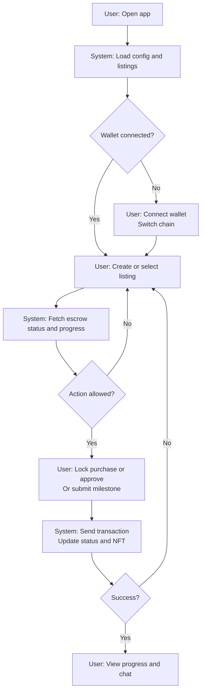
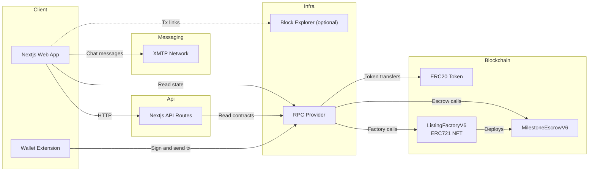

# Wagyu Milestone Escrow

[](./README.md)
[](./README.en.md)


A milestone-based escrow app for wagyu, sake, and craft listings.
Each listing deploys its own `MilestoneEscrowV6` and mints an ERC721 NFT that transfers after buyer lock.
After buyer approval, milestones release funds and progress is visualized via dynamic NFT + XMTP chat.

## Features

- `ListingFactoryV6` deploys `MilestoneEscrowV6` per listing and mints the NFT
- `open → locked → active → completed/cancelled` state flow with buyer approval (`approve()`)
- Buyer cancellation with refund while LOCKED (`cancel()`)
- Dynamic NFT metadata + SVG image API (`/api/nft/:tokenId`)
- XMTP chat, JA/EN UI, and MetaMask chain switching

## Requirements

- Node.js (compatible with Next.js 15)
- pnpm
- EVM wallet (MetaMask, etc.)
- RPC endpoint (supported: Sepolia 11155111 / Base Sepolia 84532 / Base 8453 / Polygon Amoy 80002)
- Deployed ListingFactoryV6 (ERC721) and ERC20 token addresses
- Solidity 0.8.24 / Foundry (if you build contracts)
- XMTP network (for chat)

## Installation

```bash
cd apps/web
pnpm install
```

## Quick Start

1. Go to `apps/web`
2. Copy `.env.example` to `.env.local`
3. Add and set required values such as `NEXT_PUBLIC_FACTORY_ADDRESS`
4. Run `pnpm dev`
5. Open `http://localhost:3000`

## Usage

### App

1. Producer connects a wallet and creates a listing (category, title, price, image URL)
2. Buyer ERC20-approves and calls `lock()` (purchase lock)
3. Buyer calls `approve()` to start milestone progress
4. Producer submits milestones in order; funds are released step-by-step
5. While LOCKED, Buyer can call `cancel()` for a refund

Note: `lock()` cannot be called by the producer.

### Dynamic NFT API

- Metadata: `GET /api/nft/:tokenId`
- Image: `GET /api/nft/:tokenId/image`

The API resolves escrows via `ListingFactoryV6.tokenIdToEscrow`.
Set `ListingFactoryV6.baseURI` to your app origin so `tokenURI` points to `/api/nft/:tokenId`.

### XMTP Chat

The app initializes and sends/receives chat messages in the browser using the XMTP SDK.

- Participants: only the producer and the current NFT owner (the NFT is transferred to the buyer on `lock()`)
- Visibility: shown on the listing detail page when `status` is not `open` / `cancelled` and the wallet matches producer or NFT owner
- NFT owner lookup: fetched from `ListingFactoryV6.ownerOf(tokenId)` (`useNftOwner`)
- Initialization: creates the XMTP client by signing with MetaMask `personal_sign`
- Peer availability: shows a warning when `canMessage` is false (peer has not enabled XMTP)
- History persistence: stores the db encryption key in `localStorage` as `xmtp_db_key_<address>` to keep history readable across sessions
- Conversation scope: 1:1 DM between the producer and the current NFT owner (secondary transfers grant access to the new owner)
- Environment: `NEXT_PUBLIC_XMTP_ENV=production` uses production; otherwise `dev`

### Smart Contract Deployment (Example: Remix / Foundry)

1. Deploy `contracts/MockERC20.sol` (for testing)
2. Deploy `ListingFactoryV6` from `contracts/ListingFactoryV6.sol`
   - `tokenAddress`: ERC20 token address
   - `uri`: app origin (e.g., `https://your-app`)
3. Create listings from the app (`MilestoneEscrowV6` is deployed automatically and the NFT is minted)

## User Flow (Mermaid)



## System Architecture (Mermaid)



## Directory Structure

```
hackson/
├── apps/
│   └── web/                    # Next.js app
│       ├── src/app/             # App Router UI + API routes
│       ├── src/components/      # UI components
│       ├── src/hooks/           # React hooks
│       ├── src/lib/             # viem/xmtp/config/i18n/ABI
│       ├── .env.example         # Environment template
│       └── package.json
├── contracts/                   # Solidity smart contracts
│   ├── ListingFactoryV6.sol     # Factory + MilestoneEscrowV6 (current)
│   ├── ListingFactoryV5.sol     # Legacy version
│   └── MockERC20.sol            # Test ERC20
├── lib/                          # OpenZeppelin contracts (submodule)
├── foundry.toml
├── README.md
├── README.en.md
└── LICENSE
```

## Configuration

`apps/web/.env.local`

```
NEXT_PUBLIC_RPC_URL=
NEXT_PUBLIC_CHAIN_ID=11155111
NEXT_PUBLIC_FACTORY_ADDRESS=
NEXT_PUBLIC_TOKEN_ADDRESS=
NEXT_PUBLIC_BLOCK_EXPLORER_TX_BASE=
NEXT_PUBLIC_XMTP_ENV=dev

# Optional (server-side override)
CHAIN_ID=

# Optional (legacy, not used by current UI)
NEXT_PUBLIC_CONTRACT_ADDRESS=
```

- `NEXT_PUBLIC_RPC_URL`: RPC URL for the target network
- `NEXT_PUBLIC_CHAIN_ID`: Chain ID (supported: Sepolia 11155111 / Base Sepolia 84532 / Base 8453 / Polygon Amoy 80002)
- `NEXT_PUBLIC_FACTORY_ADDRESS`: ListingFactoryV6 address (required by UI and API)
- `NEXT_PUBLIC_TOKEN_ADDRESS`: ERC20 token address
- `NEXT_PUBLIC_BLOCK_EXPLORER_TX_BASE`: Base URL for tx links (optional)
- `NEXT_PUBLIC_XMTP_ENV`: XMTP environment (`dev` or `production`)
- `CHAIN_ID`: Chain ID override for API routes (optional)
- `NEXT_PUBLIC_CONTRACT_ADDRESS`: Legacy variable (not used in the current UI)

## Development

```bash
cd apps/web
pnpm dev
pnpm dev:turbo
pnpm build
pnpm start
pnpm lint
```

## License

MIT License. See `LICENSE`.
