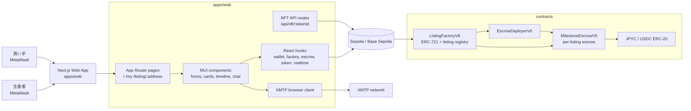
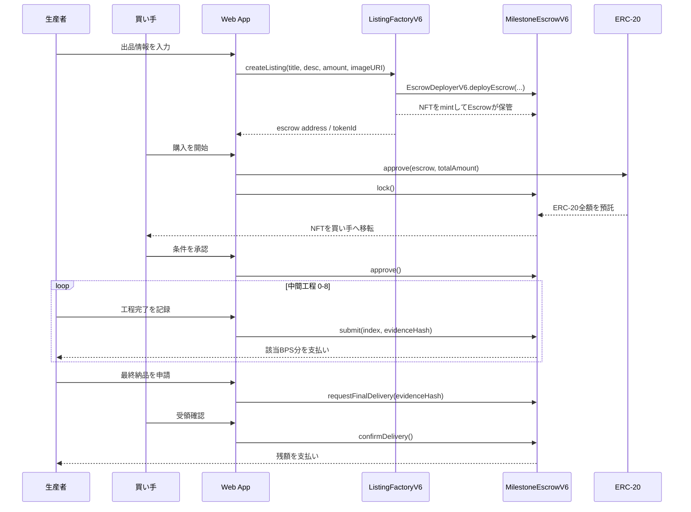
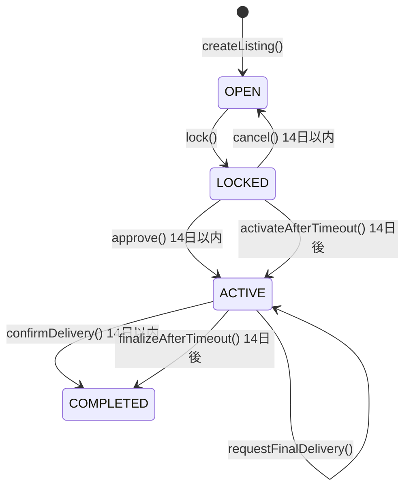
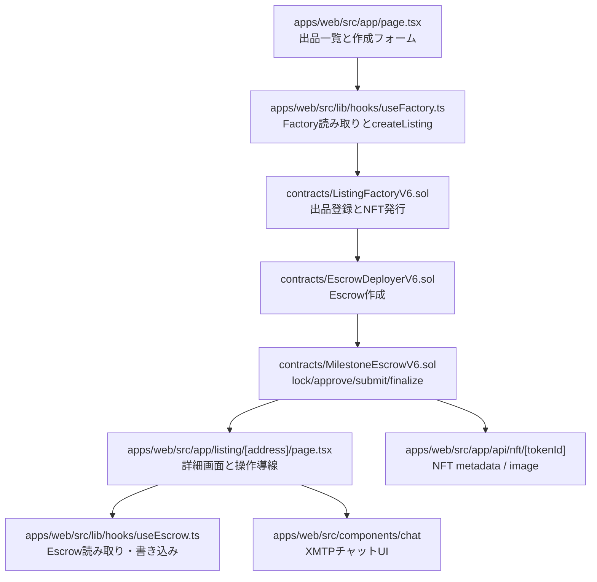

# Proof of Trust

[](README.en.md)
[](apps/web/Dockerfile)
[](foundry.toml)
[](LICENSE)

> 高額B2B取引向けに、工程連動の段階支払い、動的NFT、当事者間チャットをまとめて扱うエスクローDAppです。

`Proof of Trust` は、和牛のように生産期間が長く、買い手と生産者の間で「前払いリスク」「進捗の見えづらさ」「納品確認の遅れ」が起きやすい取引を対象にしています。買い手はERC-20をエスクローへ預け、生産者は工程完了ごとに支払いを受け取り、NFTは取引の状態と進捗を表す権利証として更新されます。

## 何ができるか

- JPYC / USDC の testnet ERC-20 で出品ごとのエスクローを作成
- 買い手が全額をロックし、開始承認後にマイルストーン支払いを進行
- 生産者が9つの中間工程を `submit()` し、最終工程は買い手確認または期限経過で完了
- 出品ごとにERC-721 NFTを発行し、NFTメタデータとSVG画像をAPIで動的生成
- 出品一覧、担当一覧、詳細画面、オンチェーンイベントタイムラインを表示
- 出品者と現在のNFT保有者だけが使うXMTPチャットを提供
- Foundryテストで再出品、期限、最終納品、手数料付きトークン拒否を検証

## 全体構成



## 取引フロー



## 状態遷移



状態の意味:

| 状態 | 画面表示 | 意味 |
| --- | --- | --- |
| `open` | 購入受付中 | NFTはEscrowが保管し、まだ買い手が決まっていない |
| `locked` | 条件確認中 | 買い手が全額預託し、NFTを保有している |
| `active` | 進行中 | 工程完了に応じて生産者へ支払いできる |
| `completed` | 取引完了 | すべての支払いが完了している |

## コードを読む順番



## リポジトリ構成

```text
.
├── apps/web/                 Next.js 15 + React 19 のDApp
│   ├── src/app/              App Router pages と NFT API routes
│   ├── src/components/       画面部品、取引操作、チャットUI
│   ├── src/hooks/            XMTPチャット用hook
│   └── src/lib/              ABI、設定、viem hook、tx utilities
├── contracts/                Solidity contracts
│   ├── ListingFactoryV6.sol  ERC-721 NFT + listing registry
│   ├── EscrowDeployerV6.sol  Escrow作成専用コントラクト
│   ├── MilestoneEscrowV6.sol 出品ごとのエスクロー本体
│   └── MockERC20.sol         Foundryテスト用ERC-20
├── script/                   Foundry deploy script
├── test/                     Foundry tests
├── lib/                      OpenZeppelin submodule
└── foundry.toml              Foundry設定
```

## 前提条件

- Node.js 20+
- `pnpm`
- Foundry（コントラクトをビルド・テストする場合）
- MetaMask
- Sepolia または Base Sepolia のRPC URL
- JPYC / USDC 相当のERC-20アドレス

対応チェーンは `apps/web/src/lib/config.ts` で定義されています。

| Chain | Chain ID |
| --- | --- |
| Sepolia | `11155111` |
| Base Sepolia | `84532` |

## Installation

```bash
pnpm --dir apps/web install
git submodule update --init --recursive
```

## Quick Start

```bash
cp apps/web/.env.example apps/web/.env.local
pnpm --dir apps/web dev
```

ブラウザで `http://localhost:3000` を開きます。

## Configuration

設定ファイルは `apps/web/.env.local` です。雛形は `apps/web/.env.example` にあります。

| 変数 | 必須 | 説明 |
| --- | --- | --- |
| `NEXT_PUBLIC_RPC_URL` | Yes | 接続先RPC URL |
| `NEXT_PUBLIC_CHAIN_ID` | Yes | `11155111` または `84532` |
| `NEXT_PUBLIC_JPYC_FACTORY_ADDRESS` | Yes | JPYC用 `ListingFactoryV6` |
| `NEXT_PUBLIC_JPYC_TOKEN_ADDRESS` | Yes | JPYC ERC-20 |
| `NEXT_PUBLIC_USDC_FACTORY_ADDRESS` | Yes | USDC用 `ListingFactoryV6` |
| `NEXT_PUBLIC_USDC_TOKEN_ADDRESS` | Yes | USDC ERC-20 |
| `NEXT_PUBLIC_BLOCK_EXPLORER_TX_BASE` | No | TxリンクのベースURL |
| `NEXT_PUBLIC_XMTP_ENV` | No | `dev` または `production` |
| `CHAIN_ID` | No | API route側のチェーンID上書き |

## スマートコントラクト

### `ListingFactoryV6`

- `1 Factory = 1 stablecoin` の設計
- constructorで `tokenAddress` が JPYC / USDC allowlist のどちらかか確認
- `createListing()` でEscrowを作り、NFTをEscrowへmint
- `tokenURI()` は `/api/nft/:tokenId?factoryAddress=...` を返す
- 通常の二次移転は制限し、Escrowが実行する移転だけを許可

### `MilestoneEscrowV6`

- `lock()` で買い手のERC-20を全額預託し、NFTを買い手へ移転
- `approve()` または `activateAfterTimeout()` で取引を開始
- `submit(index, evidenceHash)` は中間工程だけを順番に完了
- `requestFinalDelivery()` の後、`confirmDelivery()` または `finalizeAfterTimeout()` で残額を支払い
- `cancel()` は `locked` かつ14日以内のみ実行でき、全額返金して `open` に戻す
- 入出金は「指定額どおり受け取った/送った」ことを確認し、手数料付きトークンを拒否

### マイルストーン配分

`MilestoneEscrowV6` と `apps/web/src/lib/constants.ts` は、和牛取引用の10工程を前提にしています。

| Index | 工程 | BPS | 支払い割合 |
| --- | --- | ---: | ---: |
| 0 | 子牛購入 | 200 | 2.0% |
| 1 | 飼育開始 | 300 | 3.0% |
| 2 | 体重100kg | 400 | 4.0% |
| 3 | 体重200kg | 500 | 5.0% |
| 4 | 体重300kg | 600 | 6.0% |
| 5 | 体重400kg | 650 | 6.5% |
| 6 | 体重500kg | 700 | 7.0% |
| 7 | 出荷準備 | 750 | 7.5% |
| 8 | 出荷 | 900 | 9.0% |
| 9 | 納品完了 | 5000 | 50.0% |

## Webアプリ

| パス | 役割 |
| --- | --- |
| `/` | 出品一覧、出品作成、担当案件の概要 |
| `/my` | 生産者/買い手別の担当一覧 |
| `/listing/:address` | Escrow詳細、支払い操作、工程記録、イベントタイムライン、チャット |
| `/api/nft/:tokenId` | NFTメタデータJSON |
| `/api/nft/:tokenId/image` | 動的SVG画像 |

主要hook:

| ファイル | 役割 |
| --- | --- |
| `apps/web/src/lib/hooks/useWallet.ts` | MetaMask接続、アカウント管理 |
| `apps/web/src/lib/hooks/useFactory.ts` | Factory一覧取得、出品作成 |
| `apps/web/src/lib/hooks/useEscrow.ts` | Escrow詳細取得、取引操作、イベント取得 |
| `apps/web/src/lib/hooks/useToken.ts` | ERC-20残高・allowance確認 |
| `apps/web/src/lib/hooks/useRealtime.ts` | 担当一覧とEscrow状態の再取得 |
| `apps/web/src/hooks/useXmtpChat.ts` | XMTP接続、会話取得、送信、復旧 |

## Development

```bash
pnpm --dir apps/web dev
pnpm --dir apps/web dev:turbo
pnpm --dir apps/web build
pnpm --dir apps/web start
pnpm --dir apps/web lint
pnpm --dir apps/web test
```

コントラクト:

```bash
forge build
forge test
```

## Testnet Deploy

`ListingFactoryV6` は `1 Factory = 1 stablecoin` です。JPYC と USDC を同じtestnetで扱う場合は、Factoryを2つデプロイします。

1. 環境変数を設定

```bash
export TESTNET_RPC_URL="https://your-testnet-rpc"
export PRIVATE_KEY="0x..."
export JPYC_TOKEN_ADDRESS="0xYourJpycTokenAddress"
export USDC_TOKEN_ADDRESS="0xYourUsdcTokenAddress"
export BASE_URI="https://your-app.example.com"
```

2. JPYC Factoryをデプロイ

```bash
export TOKEN_ADDRESS="$JPYC_TOKEN_ADDRESS"
forge script script/DeployListingFactoryV6.s.sol:DeployListingFactoryV6 \
  --rpc-url "$TESTNET_RPC_URL" \
  --broadcast
```

3. USDC Factoryをデプロイ

```bash
export TOKEN_ADDRESS="$USDC_TOKEN_ADDRESS"
forge script script/DeployListingFactoryV6.s.sol:DeployListingFactoryV6 \
  --rpc-url "$TESTNET_RPC_URL" \
  --broadcast
```

4. `apps/web/.env.local` にデプロイ済みアドレスを設定

```bash
NEXT_PUBLIC_RPC_URL=https://your-testnet-rpc
NEXT_PUBLIC_CHAIN_ID=84532
NEXT_PUBLIC_JPYC_FACTORY_ADDRESS=0xYourJpycFactoryAddress
NEXT_PUBLIC_JPYC_TOKEN_ADDRESS=0xYourJpycTokenAddress
NEXT_PUBLIC_USDC_FACTORY_ADDRESS=0xYourUsdcFactoryAddress
NEXT_PUBLIC_USDC_TOKEN_ADDRESS=0xYourUsdcTokenAddress
NEXT_PUBLIC_XMTP_ENV=dev
```

## テストで確認していること

- Factory作成時にNFTがEscrowへmintされる
- JPYC / USDC以外のstablecoin設定を拒否する
- `cancel()` 後に再出品でき、NFTがEscrow保管へ戻る
- producer自身の購入を拒否する
- `locked` の14日期限と `active` へのタイムアウト遷移
- 最終納品確認の14日期限とタイムアウト完了
- 手数料付きERC-20の入金不足や出金差額を拒否する
- `formatAmount()` がJPYC/USDCの小数桁を正しく表示する

## 関連ファイル

- `docs/planidea.md`
- `TODOS.md`
- `apps/web/.env.example`
- `script/DeployListingFactoryV6.s.sol`

## License

MIT License. See `LICENSE`.
