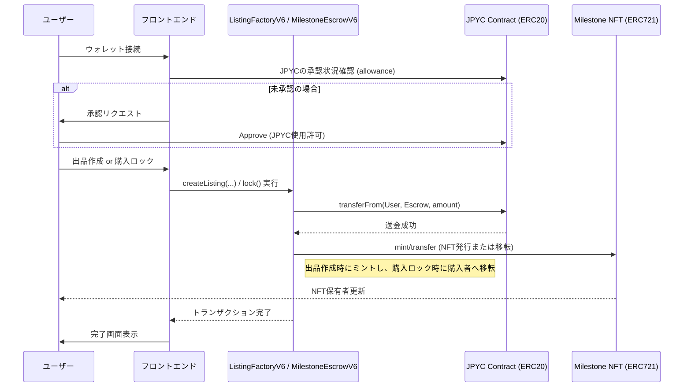
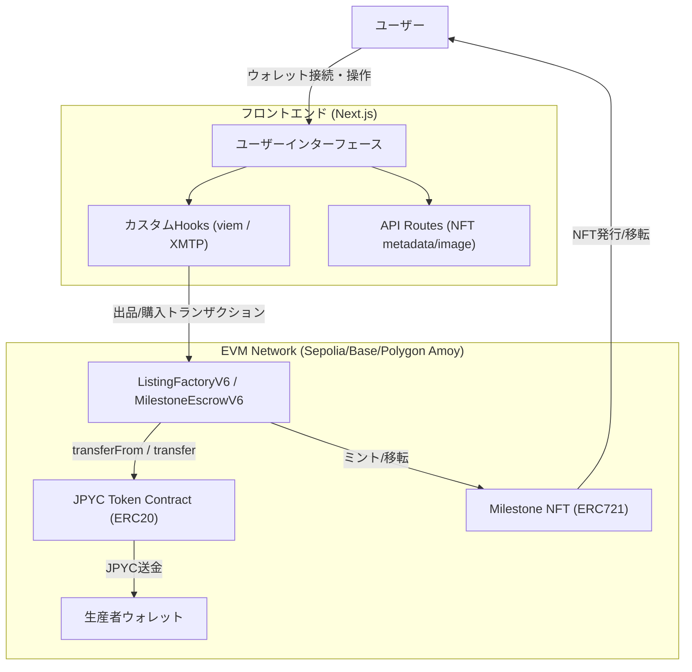

# Wagyu Milestone Escrow

[](README.en.md)
[](LICENSE)

> 和牛・日本酒・工芸品の出品に対応した、マイルストーン型エスクローDApp。出品ごとに `ListingFactoryV6` が `MilestoneEscrowV6` と ERC721 NFT を生成し、進捗はオンチェーン状態・Dynamic NFT・XMTPチャットで確認できます。

## Features

- 出品ごとに `MilestoneEscrowV6` をデプロイし、ERC721 NFTを発行
- `open → locked → active → completed/cancelled` の状態遷移と買い手承認フロー（`approve()`）
- `lock()` 時のERC20移転、マイルストーン完了ごとの段階的支払いと最終受領確認
- Dynamic NFTのメタデータ/SVG画像API（`/api/nft/:tokenId`）
- XMTPチャットと日英UI切替（MetaMask連携）
- AIアシスタントページ（`/agent`）によるチャット支援（Gemini APIキーが必要）

## Requirements

- Node.js と pnpm（Next.jsアプリの実行）
- MetaMask（ウォレット接続）
- RPCエンドポイント（対応: Sepolia / Base Sepolia / Base / Polygon Amoy）
- ListingFactoryV6 と ERC20トークンのデプロイ済みアドレス
- XMTPネットワーク（チャット機能を使う場合）
- Gemini APIキー（AIアシスタントを使う場合）
- Foundry + Solidity 0.8.24（コントラクトをビルドする場合）

## Installation

```bash
cd apps/web
pnpm install
```

## Quick Start

1. `apps/web` に移動
2. `.env.example` を `.env.local` にコピー
3. 必須項目（`NEXT_PUBLIC_RPC_URL`, `NEXT_PUBLIC_CHAIN_ID`, `NEXT_PUBLIC_FACTORY_ADDRESS`, `NEXT_PUBLIC_TOKEN_ADDRESS`）を設定
4. `pnpm dev` を実行
5. `http://localhost:3000` を開く

## Usage

### アプリ

1. Producerがウォレット接続し、カテゴリ・タイトル・価格・画像URLを指定して出品
2. BuyerがERC20の `approve` を行い `lock()` を実行（購入ロック）
3. Buyerが `approve()` で進行開始を承認（`locked → active`）
4. Producerがマイルストーンを順に完了報告し、段階的に支払いが解放
5. LOCKED中はBuyerが `cancel()` で返金可能、最後は `confirmDelivery()` で完了

### Dynamic NFT API

- メタデータ: `GET /api/nft/:tokenId`
- 画像: `GET /api/nft/:tokenId/image`

APIは `ListingFactoryV6.tokenIdToEscrow` からエスクローを解決します。
`ListingFactoryV6.baseURI` はアプリのオリジン（例: `https://your-app`）を設定してください。

### AIアシスタント

- ルート: `/agent`
- 事前に `GEMINI_API_KEY` を設定して起動してください

### XMTPチャット

- 参加者: 出品者と「現在のNFT所有者」
- 表示条件: `status` が `open` / `cancelled` 以外、かつ出品者またはNFT所有者
- 接続/署名: MetaMaskの `personal_sign` でXMTPクライアントを作成
- 履歴保持: 暗号化キーを `localStorage` の `xmtp_db_key_<address>` に保存
- 環境切替: `NEXT_PUBLIC_XMTP_ENV=production` の場合のみ本番

### Smart Contract Deployment（Example）

1. `contracts/MockERC20.sol` をデプロイ（テスト用）
2. `contracts/ListingFactoryV6.sol` から `ListingFactoryV6` をデプロイ（`tokenAddress` はERC20トークン、`uri` はアプリのオリジン）
3. アプリから `createListing` を実行（`MilestoneEscrowV6` が自動デプロイ）

## User Flow



## System Architecture



## Directory Structure

```
hackathon/
├── apps/
│   └── web/                    # Next.js アプリ
│       ├── src/app/             # App Router UI + API routes
│       ├── src/components/      # UI components
│       ├── src/hooks/           # XMTPなどのクライアントHook
│       ├── src/lib/             # viem/xmtp/config/i18n/ABI
│       ├── .env.example         # 環境変数テンプレート
│       └── package.json
├── contracts/                   # Solidity smart contracts
│   ├── ListingFactoryV6.sol     # Factory + MilestoneEscrowV6（現行）
│   ├── ListingFactoryV5.sol     # Legacy版
│   └── MockERC20.sol            # テスト用ERC20
├── lib/                         # OpenZeppelin contracts (vendor)
├── foundry.toml
└── LICENSE
```

## Configuration

`apps/web/.env.local`

```
NEXT_PUBLIC_RPC_URL=
NEXT_PUBLIC_CHAIN_ID=11155111
NEXT_PUBLIC_FACTORY_ADDRESS=
NEXT_PUBLIC_TOKEN_ADDRESS=
NEXT_PUBLIC_BLOCK_EXPLORER_TX_BASE=
NEXT_PUBLIC_XMTP_ENV=dev

# Optional (server-side override for API routes)
CHAIN_ID=

# Optional (legacy, not used by current UI)
NEXT_PUBLIC_CONTRACT_ADDRESS=

# Optional (AI assistant)
GEMINI_API_KEY=
GEMINI_MODEL=gemini-2.5-flash-preview-05-20
```

- `NEXT_PUBLIC_RPC_URL`: 対象ネットワークのRPC URL
- `NEXT_PUBLIC_CHAIN_ID`: Chain ID（対応: Sepolia / Base Sepolia / Base / Polygon Amoy）
- `NEXT_PUBLIC_FACTORY_ADDRESS`: `ListingFactoryV6` のアドレス（UI/APIで必須）
- `NEXT_PUBLIC_TOKEN_ADDRESS`: ERC20トークンのアドレス
- `NEXT_PUBLIC_BLOCK_EXPLORER_TX_BASE`: 取引URLのベース（任意）
- `NEXT_PUBLIC_XMTP_ENV`: XMTP環境（`dev` または `production`）
- `CHAIN_ID`: APIルート用のChain ID上書き（任意）
- `NEXT_PUBLIC_CONTRACT_ADDRESS`: 旧構成用（現行UIでは未使用）
- `GEMINI_API_KEY`: AIアシスタント用のAPIキー（任意）
- `GEMINI_MODEL`: Geminiモデル名（任意、未指定時は `gemini-2.5-flash-preview-05-20`）

## Development

```bash
cd apps/web
pnpm dev
pnpm dev:turbo
pnpm build
pnpm start
pnpm lint
```

## License

MIT License. See `LICENSE`.
