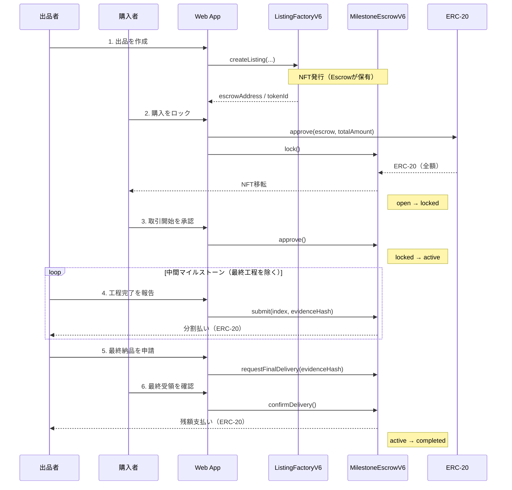

# Proof of Trust

[](README.en.md)
[](apps/web/Dockerfile)
[](foundry.toml)
[](LICENSE)

> 高額B2B取引向けに、工程連動の段階支払い・動的NFT・当事者間チャットを統合したエスクローDAppです。

## 概要

`Proof of Trust` は、和牛・日本酒・工芸品のような長期生産型取引で発生する「前払いリスク」と「進捗可視化」の課題を解決するためのプロジェクトです。

- Webアプリ: Next.js 15 + React 19 + viem
- コントラクト: `ListingFactoryV6` / `MilestoneEscrowV6`（Solidity 0.8.24）
- 決済: ERC-20
- 権利証: ERC-721（動的メタデータ / SVG画像）
- チャット: XMTP（E2E暗号化）

## 主要取引シーケンス



補足:
- `cancel()` は `locked` 中のみ購入者が実行でき、全額返金後にNFTは escrow 保管へ戻り、listing は `open` に戻ります。
- `locked` で 14 日を過ぎた場合は `activateAfterTimeout()` で `active` に進めます。
- `requestFinalDelivery()` 後 14 日を過ぎた場合は `finalizeAfterTimeout()` で最終支払いを確定できます。

## 主な機能

- 出品ごとに `MilestoneEscrowV6` を新規デプロイし、対応NFTを発行
- ステータス遷移
  - `open -> locked -> active -> completed`
  - `locked -> open`（`cancel()` で再販可能に復帰）
- `lock()` で購入者がERC-20を預け入れ、`approve()` または `activateAfterTimeout()` 後に工程支払いを開始
- 出品者が中間マイルストーンを `submit()`、最終工程は `requestFinalDelivery()` -> `confirmDelivery()` / `finalizeAfterTimeout()`
- 出品詳細ページに取引タイムライン（オンチェーンイベント）を表示
- NFT API
  - `GET /api/nft/:tokenId`（メタデータ）
  - `GET /api/nft/:tokenId/image`（動的SVG）
- XMTPチャット（出品者とNFT所有者のみ表示）

## リポジトリ構成

```text
apps/web/    Next.js 15 フロントエンド + API routes
contracts/   Solidity コントラクト（Factory/Escrow/MockERC20）
docs/        構成図・デモ台本・動画成果物
lib/         Foundryライブラリ（OpenZeppelinサブモジュール）
```

## 前提条件

- Node.js 20+
- `pnpm`
- MetaMask
- 対象チェーンのRPC URL
- デプロイ済みコントラクトアドレス
  - `ListingFactoryV6`
  - 決済用ERC-20

対応チェーン（`apps/web/src/lib/config.ts`）:

- Sepolia (`11155111`)
- Base Sepolia (`84532`)
- Base (`8453`)
- Polygon Amoy (`80002`)
- Avalanche Fuji (`43113`, デフォルト)

Foundryでコントラクトをビルドする場合は、先にサブモジュールを初期化してください。

```bash
git submodule update --init --recursive
```

## Installation

```bash
pnpm --dir apps/web install
```

## Quick Start

```bash
cp apps/web/.env.example apps/web/.env.local
pnpm --dir apps/web dev
```

ブラウザで `http://localhost:3000` を開きます。

## 設定（`.env.local`）

設定ファイル: `apps/web/.env.local`

### 必須（DApp本体）

| 変数 | 説明 |
| --- | --- |
| `NEXT_PUBLIC_RPC_URL` | 接続先RPC URL |
| `NEXT_PUBLIC_CHAIN_ID` | チェーンID |
| `NEXT_PUBLIC_FACTORY_ADDRESS` | `ListingFactoryV6` アドレス |
| `NEXT_PUBLIC_TOKEN_ADDRESS` | 決済用ERC-20アドレス |

### 任意（表示・運用）

| 変数 | 説明 |
| --- | --- |
| `NEXT_PUBLIC_BLOCK_EXPLORER_TX_BASE` | TxリンクのベースURL |
| `CHAIN_ID` | APIルート側のチェーンID上書き |
| `NEXT_PUBLIC_XMTP_ENV` | `dev` または `production` |

## スマートコントラクト仕様（V6）

### Factory

- `ListingFactoryV6.createListing(...)` でEscrowをデプロイ
- NFTは初期状態でEscrowが保有
- セカンダリ移転はEscrow経由フローのみに制限

### Escrow

- `lock()`
  - 購入者がERC-20を預け入れ
  - NFTが購入者へ移転
  - `open -> locked`
- `approve()`
  - 購入者が期限内に取引開始
  - `locked -> active`
- `activateAfterTimeout()`
  - `locked` から 14 日経過後に誰でも実行可
  - `locked -> active`
- `submit(index, evidenceHash)`
  - 出品者が中間工程を完了報告
- `requestFinalDelivery(evidenceHash)`
  - 出品者が最終納品を申請し、購入者確認の期限を開始
- `confirmDelivery()`
  - 購入者が期限内に最終受領確認（残額支払い）
  - `active -> completed`
- `finalizeAfterTimeout()`
  - 最終確認期限経過後に誰でも実行可
  - `active -> completed`
- `cancel()`
  - `locked` 状態のみ購入者が実行可
  - NFTを escrow 保管へ戻し、全額返金
  - `locked -> open`

### マイルストーン配分（BPS, 合計10000）

| categoryType | カテゴリ | 工程数 | BPS配列 |
| --- | --- | --- | --- |
| `0` | wagyu | 10 | `200,300,400,500,600,650,700,750,900,5000` |
| `1` | sake | 5 | `1000,1500,1500,2000,4000` |
| `2` | craft | 4 | `1000,2000,2500,4500` |

## API

### NFT API

| Method | Path | 用途 |
| --- | --- | --- |
| `GET` | `/api/nft/:tokenId` | NFTメタデータJSON |
| `GET` | `/api/nft/:tokenId/image` | 動的SVG画像 |

`factoryAddress` クエリで対象Factoryを明示できます。

## Development

```bash
pnpm --dir apps/web dev
pnpm --dir apps/web dev:turbo
pnpm --dir apps/web build
pnpm --dir apps/web start
pnpm --dir apps/web lint
```

コントラクト（任意）:

```bash
forge build
```

## Fuji Testnet Deploy

`ListingFactoryV6` の constructor は `tokenAddress` と `baseURI` の2つです。[contracts/ListingFactoryV6.sol](/Users/you/programming/hackathon/contracts/ListingFactoryV6.sol#L441)

`baseURI` には、NFTメタデータAPIを配信するWebアプリの公開URLを入れてください。たとえば `https://your-app.example.com` を指定すると、`tokenURI()` は `https://your-app.example.com/api/nft/<tokenId>` を返します。[contracts/ListingFactoryV6.sol](/Users/you/programming/hackathon/contracts/ListingFactoryV6.sol#L476)

1. 環境変数を設定

```bash
export AVALANCHE_FUJI_RPC_URL="https://your-fuji-rpc"
export PRIVATE_KEY="0x..."
```

2. 決済用ERC-20が未デプロイなら、テスト用トークンを先にデプロイ

```bash
export TOKEN_NAME="Mock JPYC"
export TOKEN_SYMBOL="mJPYC"
export TOKEN_DECIMALS="18"
forge script script/DeployMockERC20.s.sol:DeployMockERC20 \
  --rpc-url "$AVALANCHE_FUJI_RPC_URL" \
  --broadcast
```

3. Factory をデプロイ

```bash
export TOKEN_ADDRESS="0xYourTokenAddress"
export BASE_URI="https://your-app.example.com"
forge script script/DeployListingFactoryV6.s.sol:DeployListingFactoryV6 \
  --rpc-url "$AVALANCHE_FUJI_RPC_URL" \
  --broadcast
```

4. フロント側の env を更新

```bash
cat > apps/web/.env.local <<'EOF'
NEXT_PUBLIC_RPC_URL=https://your-fuji-rpc
NEXT_PUBLIC_CHAIN_ID=43113
NEXT_PUBLIC_FACTORY_ADDRESS=0xYourFactoryAddress
NEXT_PUBLIC_TOKEN_ADDRESS=0xYourTokenAddress
EOF
```

5. 起動して動作確認

```bash
pnpm --dir apps/web dev
```

補足:
- コントラクトのデプロイアドレスは `broadcast/` 配下の実行結果か、`forge script` の出力から確認できます。
- `MockERC20` は `mint()` が誰でも呼べるテスト用トークンです。本番相当の検証以外では使わないでください。[contracts/MockERC20.sol](/Users/you/programming/hackathon/contracts/MockERC20.sol#L36)

## 関連ドキュメント

- `docs/architecture.mmd`
- `docs/demo-script.md`
- `docs/demo-video/README.md`
- `docs/zenn-article-draft.md`

## License

MIT License. See `LICENSE`.
