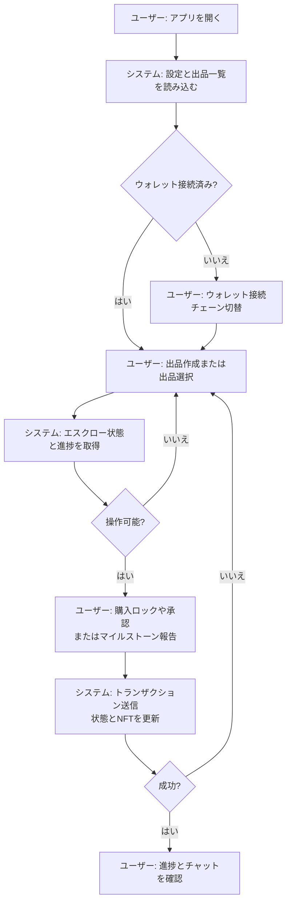
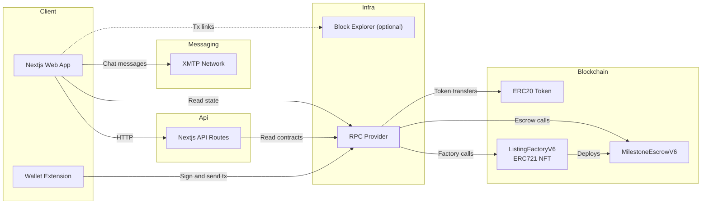

# Wagyu Milestone Escrow

[](./README.md)
[](./README.en.md)


和牛・日本酒・工芸品の出品に対応した、マイルストーン型エスクローアプリです。
出品ごとに `MilestoneEscrowV6` と ERC721 NFT を生成し、購入者のロック後にNFTが移転します。
買い手の承認後にマイルストーンが進行し、進捗はDynamic NFTとXMTPチャットで可視化されます。

## Features

- `ListingFactoryV6` が出品ごとに `MilestoneEscrowV6` をデプロイし、NFTをミント
- `open → locked → active → completed/cancelled` の状態遷移と買い手承認フロー（`approve()`）
- 買い手がロック後にキャンセル可能（`cancel()` は LOCKED のみ）
- Dynamic NFTのメタデータ/SVG生成API（`/api/nft/:tokenId`）
- XMTPチャット、日英切替UI、MetaMaskチェーン切替対応

## Requirements

- Node.js（Next.js 15 互換）
- pnpm
- EVMウォレット（MetaMaskなど）
- RPCエンドポイント（対応: Sepolia 11155111 / Base Sepolia 84532 / Base 8453 / Polygon Amoy 80002）
- ListingFactoryV6（ERC721）とERC20トークンのデプロイ済みアドレス
- Solidity 0.8.24 / Foundry（コントラクトをビルドする場合）
- XMTPネットワーク（チャット機能を使う場合）

## Installation

```bash
cd apps/web
pnpm install
```

## Quick Start

1. `apps/web` に移動
2. `.env.example` を `.env.local` にコピー
3. `NEXT_PUBLIC_FACTORY_ADDRESS` など必須項目を追加・設定
4. `pnpm dev` を実行
5. `http://localhost:3000` を開く

## Usage

### アプリ

1. Producerがウォレット接続し、カテゴリ・タイトル・価格・画像URLを指定して出品
2. BuyerがERC20を `approve` して `lock()` を実行（購入ロック）
3. Buyerが `approve()` で進行開始を承認
4. Producerがマイルストーンを順に完了報告し、段階的に支払いが解放
5. LOCKED中はBuyerが `cancel()` で返金可能

※ `lock()` はProducer本人からは実行できません。

### Dynamic NFT API

- メタデータ: `GET /api/nft/:tokenId`
- 画像: `GET /api/nft/:tokenId/image`

APIは `ListingFactoryV6.tokenIdToEscrow` からエスクローを解決します。
`ListingFactoryV6.baseURI` はアプリのオリジンに設定してください（`/api/nft/:tokenId` を参照します）。

### XMTPチャット

アプリはブラウザ内でXMTP SDKを使ってチャットを初期化・送受信します。

- 参加者: 出品者と「現在のNFT所有者」のみ（`lock()` 実行時にNFTは購入者へ移転）
- 表示条件: 出品詳細ページで `status` が `open` / `cancelled` 以外 かつウォレットが出品者またはNFT所有者の場合
- NFT所有者判定: `ListingFactoryV6.ownerOf(tokenId)` を参照して取得（`useNftOwner`）
- 接続/署名: MetaMaskの `personal_sign` で署名しXMTPクライアントを作成
- 相手の有効化: `canMessage` が false の場合は警告を表示（相手がXMTP未有効）
- 履歴保持: 暗号化キーを `localStorage` の `xmtp_db_key_<address>` に保存し再訪問時も復号
- 会話スコープ: 出品者 ↔ 現在のNFT所有者の1:1 DM（NFTが転売されると新しい所有者が参加可能）
- 環境切替: `NEXT_PUBLIC_XMTP_ENV` が `production` の時のみ本番、それ以外は `dev`

### Smart Contract Deployment（Example: Remix / Foundry）

1. `contracts/MockERC20.sol` をデプロイ（テスト用）
2. `contracts/ListingFactoryV6.sol` から `ListingFactoryV6` をデプロイ
   - `tokenAddress`: ERC20トークンアドレス
   - `uri`: アプリのオリジン（`https://your-app` など）
3. アプリから `createListing` を実行（`MilestoneEscrowV6` が自動デプロイされNFTがミント）

## User Flow (Mermaid)



## System Architecture (Mermaid)



## Directory Structure

```
hackson/
├── apps/
│   └── web/                    # Next.js アプリ
│       ├── src/app/             # App Router UI + API routes
│       ├── src/components/      # UI components
│       ├── src/hooks/           # React hooks
│       ├── src/lib/             # viem/xmtp/config/i18n/ABI
│       ├── .env.example         # 環境変数テンプレート
│       └── package.json
├── contracts/                   # Solidity smart contracts
│   ├── ListingFactoryV6.sol     # Factory + MilestoneEscrowV6（現行）
│   ├── ListingFactoryV5.sol     # Legacy版
│   └── MockERC20.sol            # テスト用ERC20
├── lib/                          # OpenZeppelin contracts (submodule)
├── foundry.toml
├── README.md
├── README.en.md
└── LICENSE
```

## Configuration

`apps/web/.env.local`

```
NEXT_PUBLIC_RPC_URL=
NEXT_PUBLIC_CHAIN_ID=11155111
NEXT_PUBLIC_FACTORY_ADDRESS=
NEXT_PUBLIC_TOKEN_ADDRESS=
NEXT_PUBLIC_BLOCK_EXPLORER_TX_BASE=
NEXT_PUBLIC_XMTP_ENV=dev

# Optional (server-side override)
CHAIN_ID=

# Optional (legacy, not used by current UI)
NEXT_PUBLIC_CONTRACT_ADDRESS=
```

- `NEXT_PUBLIC_RPC_URL`: 対象ネットワークのRPC URL
- `NEXT_PUBLIC_CHAIN_ID`: Chain ID（対応: Sepolia 11155111 / Base Sepolia 84532 / Base 8453 / Polygon Amoy 80002）
- `NEXT_PUBLIC_FACTORY_ADDRESS`: ListingFactoryV6 のアドレス（UIとAPIで必須）
- `NEXT_PUBLIC_TOKEN_ADDRESS`: ERC20トークンのアドレス
- `NEXT_PUBLIC_BLOCK_EXPLORER_TX_BASE`: 取引URLのベース（任意）
- `NEXT_PUBLIC_XMTP_ENV`: XMTP環境（`dev` または `production`）
- `CHAIN_ID`: APIルート用のChain ID上書き（任意）
- `NEXT_PUBLIC_CONTRACT_ADDRESS`: 旧構成用（現行UIでは未使用）

## Development

```bash
cd apps/web
pnpm dev
pnpm dev:turbo
pnpm build
pnpm start
pnpm lint
```

## License

MIT License. See `LICENSE`.
