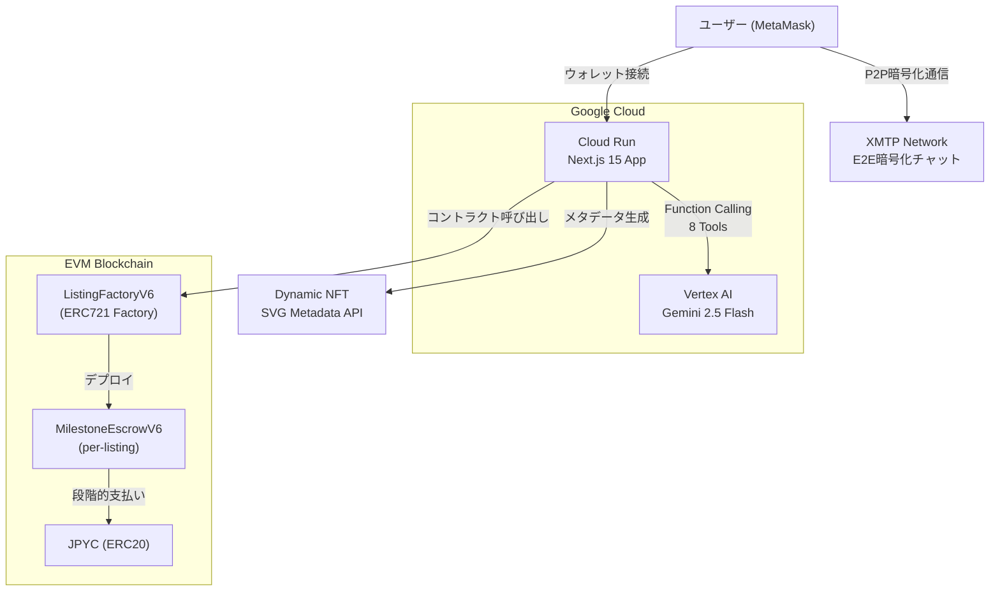

# 第4回 Agentic AI Hackathon with Google Cloud 応募計画

## Context

「Wagyu Milestone Escrow」を「第4回 Agentic AI Hackathon with Google Cloud」に応募するための改善計画。

**現状**: 和牛・日本酒・工芸品向けマイルストーン型エスクローdAppとして完成度は高いが、Google Cloud製品を一切使っていないため応募資格を満たしていない。

**期限**: 2026年2月15日（残り6日）

**目標**: 応募ブロッカーを解消し、「Agentic AI」テーマでの競争力を最大化する。

---

## 戦略方針

**応募カテゴリ: 2. 業務システム**

理由: 既存のNext.jsコードベースを最大限活用しつつ、AIエージェントを「B2Bサプライチェーンの自律的ビジネスアドバイザー」として位置付ける。カテゴリ4（ADKマルチエージェント）はPythonバックエンドの新規構築が必要で、6日では高リスク。

**ストーリー**: 「地方の生産者と購入者の信頼障壁を、スマートコントラクト×AIエージェントで解消する自律型B2Bマーケットプレイス」

---

## ブロッカー一覧と対応

### BLOCKER 1: Google Cloud AIプロダクト未使用 (Category B違反)

**現状**: `@google/generative-ai@0.24.1` (Google AI Studio SDK) → カウントされない
**対応**: `@google/genai` (統合SDK) に移行し、Vertex AI バックエンドで利用
**実装順序**: まず30-60分の移行スパイクでAPI差分を確認してから本実装に入る（`route.ts` の呼び出し差異での手戻り防止）

**変更ファイル**:
- `apps/web/package.json` — `@google/generative-ai` → `@google/genai` に差し替え
- `apps/web/src/lib/agent/gemini.ts` — SDK初期化・ツール定義の書き換え
- `apps/web/src/app/api/agent/chat/route.ts` — チャットセッション・レスポンス処理の更新
- `apps/web/.env.example` — `GCP_PROJECT_ID`, `GCP_LOCATION` 追加

**主な変更点**:
```
// Before (@google/generative-ai)
import { GoogleGenerativeAI } from "@google/generative-ai";
const genAI = new GoogleGenerativeAI(process.env.GEMINI_API_KEY);
const model = genAI.getGenerativeModel({ model: "gemini-2.5-flash-..." });
const chat = model.startChat({ history });
const result = await chat.sendMessage(msg);
const text = result.response.text();            // method call
const fns = result.response.functionCalls?.();   // method call

// After (@google/genai with Vertex AI)
import { GoogleGenAI, Type } from "@google/genai";
const ai = new GoogleGenAI({ vertexai: true, project: GCP_PROJECT_ID, location: GCP_LOCATION });
const chat = ai.chats.create({ model, config: { systemInstruction, tools }, history });
const response = await chat.sendMessage({ message: msg });
const text = response.text;                      // property
const fns = response.functionCalls;              // property
```

**ツール定義の変更**: `"OBJECT"` → `Type.OBJECT`, `"STRING"` → `Type.STRING` など

**認証**: Cloud Run上ではApplication Default Credentials (ADC) が自動適用。ローカル開発は `gcloud auth application-default login`。

**工数**: 4-6時間 | **リスク**: 中（型とレスポンス構造の差異に注意）

---

### BLOCKER 2: Google Cloud実行プロダクト未使用 (Category A違反)

**現状**: Vercel向け設計。Dockerfileなし。
**対応**: Cloud Runにデプロイ
**運用前提**: 現在のAgentセッションはインメモリのため、提出デモ期間は `--max-instances=1` で運用する

**変更・新規ファイル**:
- `apps/web/next.config.ts` — `output: "standalone"` 追加
- `apps/web/Dockerfile` — 新規作成（pnpm対応マルチステージビルド）
- `apps/web/.dockerignore` — 新規作成

**Dockerfile概要**:
```dockerfile
FROM node:20-alpine AS base
RUN corepack enable && corepack prepare pnpm@latest --activate

FROM base AS deps
WORKDIR /app
COPY package.json pnpm-lock.yaml ./
RUN pnpm install --frozen-lockfile

FROM base AS builder
WORKDIR /app
COPY --from=deps /app/node_modules ./node_modules
COPY . .
RUN pnpm build

FROM node:20-alpine AS runner
WORKDIR /app
ENV NODE_ENV=production
COPY --from=builder /app/.next/standalone ./
COPY --from=builder /app/.next/static ./.next/static
COPY --from=builder /app/public ./public
EXPOSE 3000
ENV PORT=3000
CMD ["node", "server.js"]
```

**注意**: `NEXT_PUBLIC_*` 環境変数はビルド時に埋め込まれる。Cloud Buildの `--substitutions` か `.env.production` で対応。

**デプロイコマンド**:
```bash
# Option A: Container Registry (gcr.io) を使う場合
cd apps/web
gcloud builds submit --tag gcr.io/$PROJECT_ID/wagyu-escrow
gcloud run deploy wagyu-escrow \
  --image gcr.io/$PROJECT_ID/wagyu-escrow \
  --platform managed --region us-central1 \
  --allow-unauthenticated --memory 512Mi \
  --max-instances=1

# Option B: Artifact Registry を使う場合
gcloud artifacts repositories create wagyu-repo \
  --repository-format=docker --location=us-central1
gcloud builds submit \
  --tag us-central1-docker.pkg.dev/$PROJECT_ID/wagyu-repo/wagyu-escrow
gcloud run deploy wagyu-escrow \
  --image us-central1-docker.pkg.dev/$PROJECT_ID/wagyu-repo/wagyu-escrow \
  --platform managed --region us-central1 \
  --allow-unauthenticated --memory 512Mi \
  --max-instances=1
```

**GCPサービスアカウント権限**: `roles/aiplatform.user`（Vertex AI用）
**補足**: 将来 `max-instances>1` にする場合は Firestore/Redis などの外部セッションストアに移行する

**工数**: 4-5時間 | **リスク**: 中（standaloneビルドの静的ファイル配信に注意）

---

### BLOCKER 3: 提出物未準備

| 提出物 | 状態 | 対応 | 工数 |
|--------|------|------|------|
| デプロイURL | 未準備 | Cloud Runデプロイで解決 | BLOCKER 2で同時解決 |
| Zenn記事 | 未作成 | 4000-6000字、アーキテクチャ図・動画含む | 4-5時間 |
| デモ動画 | 未作成 | 3分以内、YouTube公開 | 2-3時間 |
| アーキテクチャ図 | 未作成 | Mermaid or Excalidraw | 1時間 |
| 参加登録 | 未完了 | 2/14までにZenn + Innovators登録 | 30分 |

---

## 競争力向上: エージェント強化（最重要）

### 現状のAgentic度と課題

**現状**: ツールループ（`while (functionCalls)`）は実装済みでマルチステップ推論は動く。しかし以下が弱い:
- エージェントが**受動的**（ユーザー指示を待つだけ、自発的行動なし）
- **分析・判断ツール**がない（データ取得＋CRUD操作のみ）
- **プロアクティブ提案**がない（先回りの情報提供なし）

**目標**: 「高機能チャットボット」→「自律的ビジネスアドバイザー」に進化させる

### 新規ツール3つ追加

**ファイル**: `apps/web/src/lib/agent/tools.ts`, `apps/web/src/lib/agent/gemini.ts`

1. **`analyze_market`** — カテゴリ別の市場分析・価格提案
   - 全リスティングを取得 → カテゴリ別に集計
   - 平均/中央値/最高/最低/出品数を算出
   - 「和牛の平均出品価格は¥350,000です。あなたの¥500,000は上位20%」
   - **Agenticな点**: AIが自発的に市場データを分析してアドバイスする
   - 実装: 既存 `getListings()` を内部利用、統計計算を追加

2. **`assess_risk`** — 購入リスク評価
   - 指定出品者の全リスティングを取得
   - completed/cancelled/active比率を算出
   - 現時点で取得可能なオンチェーン指標（状態比率、進捗率、アクティブ案件数）で評価
   - 納期推定はイベント時系列が揃うまでは実装しない（過剰推論を避ける）
   - リスクスコア（low/medium/high）と理由を返す
   - **Agenticな点**: AIが自主判断でリスクを評価・警告する

3. **`suggest_next_action`** — プロアクティブ状況分析
   - ウォレットアドレスで全リスティングを検索
   - Producer/Buyer両方の役割で状態を確認
   - 「承認待ち2件」「マイルストーン報告可能1件」等の具体的提案
   - **Agenticな点**: 会話開始時にAIが先回りしてユーザーの状況を把握・提案

全て既存の `getClient()` + `readEscrowSummary()` で実装可能（read-only）。

**性能ガードレール（必須）**:
- `getListings()` の内部上限を設定（例: 最大50件）
- 集計処理は `Promise.all` で並列化し、ツール実行タイムアウト（例: 8秒）を設ける
- タイムアウト時は「部分結果 + 次アクション提案」で返す

**工数**: 3時間 | **リスク**: 低

### システムプロンプト大幅改善

**ファイル**: `apps/web/src/lib/agent/prompts.ts`

現状の問題: プロンプトが「ツールの使い方マニュアル」になっていて、自律行動を指示していない。

**改善内容**:

```
## あなたの行動原則（重要）

あなたは受動的なチャットボットではなく、**能動的なビジネスアドバイザー**です。

1. **プロアクティブ分析**: 会話開始時、ユーザーのウォレット情報があれば
   必ず `suggest_next_action` を呼び出し、状況を把握してから応答する。
   「何かお手伝いできることはありますか？」ではなく、
   「承認待ちの購入が2件あります。まずこちらを確認しませんか？」のように具体的に。

2. **自律的市場分析**: 出品の価格が話題になったら、必ず `analyze_market` を
   呼び出して市場データに基づいたアドバイスを提供する。
   「50万円でいいですか？」ではなく、
   「和牛カテゴリの平均は35万円です。A5ランクなら50万円は適正〜やや高めです」。

3. **リスク警告の自主判断**: 購入検討時、`assess_risk` を自動実行して
   リスクが高い場合は明確に警告する。ユーザーが聞かなくても。

4. **マルチステップ推論**: 1つのユーザー発言に対して、複数のツールを
   連鎖的に使い、包括的な情報を提供する。
   例: 「和牛を買いたい」→ get_listings → analyze_market → 推薦
```

**工数**: 1時間 | **リスク**: 低

### route.ts のエージェント初期化改善

**ファイル**: `apps/web/src/app/api/agent/chat/route.ts`

最初のメッセージ時にユーザーアドレスがある場合、内部的に `suggest_next_action` を事前実行し、
コンテキストとしてシステムプロンプトに追加。これにより最初の応答からプロアクティブな提案が可能。

```typescript
// 初回メッセージ時にユーザー状況を事前取得
if (session.history.length === 0 && effectiveUserAddress) {
  const userContext = await executeTool("suggest_next_action", {
    userAddress: effectiveUserAddress
  });
  // システムコンテキストに追加
}
```

**工数**: 30分 | **リスク**: 低

---

## 日別スケジュール

### Day 1 (2/10 火) — SDK移行

| 時間 | タスク | ファイル |
|------|--------|----------|
| 1h | 移行スパイク（API差分の最小検証） | `gemini.ts`, `route.ts` |
| 1h | GCPプロジェクト設定、Vertex AI API有効化 | GCP Console |
| 3h | `@google/genai` への移行実装 | `gemini.ts`, `route.ts`, `package.json` |
| 1h | 型・インポートの更新 | `route.ts`, `types.ts` |
| 2h | ローカルテスト (`gcloud auth application-default login`) | ランタイム |

**完了条件**: エージェントチャットがVertex AI経由でローカル動作、`pnpm lint && pnpm build` 通過

### Day 2 (2/11 水) — Cloud Runデプロイ

| 時間 | タスク | ファイル |
|------|--------|----------|
| 1h | `output: "standalone"` 追加、ローカルビルドテスト | `next.config.ts` |
| 2h | Dockerfile + .dockerignore 作成、Dockerビルドテスト | 新規ファイル |
| 1h | セッション運用方針確定（`max-instances=1`） | gcloud CLI |
| 2h | Cloud Runデプロイ + 環境変数設定 + デバッグ | gcloud CLI |
| 2h | 動作確認（エージェント、リスティング、NFT API） | ランタイム |

**完了条件**: Cloud Run上で主要フロー動作（出品/購入/エージェント）

### Day 3 (2/12 木) — エージェント強化

| 時間 | タスク | ファイル |
|------|--------|----------|
| 3h | 新規ツール3つ実装 | `tools.ts`, `gemini.ts` |
| 1h | システムプロンプト更新 | `prompts.ts` |
| 1h | ローカルテスト | ランタイム |
| 1h | Cloud Runに再デプロイ | gcloud CLI |
| 2h | Zenn記事の構成・下書き60% | Zenn |

**完了条件**: 8ツールのエージェントがCloud Runで動作、ツールタイムアウト時のフォールバック確認

### Day 4 (2/13 金) — ドキュメント・デモ

| 時間 | タスク | ファイル |
|------|--------|----------|
| 1h | README更新（GCPデプロイ手順追加） | `README.md` |
| 1h | `.env.example` 更新 | `.env.example` |
| 1h | アーキテクチャ図作成 | Mermaid/Excalidraw |
| 2h | デモ動画撮影・編集 | OBS/Loom |
| 3h | Zenn記事完成 | Zenn |

**完了条件**: デモ動画完成、記事90%完成

### Day 5 (2/14 土) — 登録 + 最終調整

| 時間 | タスク | ファイル |
|------|--------|----------|
| 1h | ハッカソン参加登録 + Innovators登録 | Web |
| 2h | Zenn記事最終仕上げ・公開 | Zenn |
| 1h | 最終Cloud Runデプロイ | gcloud CLI |
| 2h | E2Eテスト・バグ修正 | 各種 |
| 2h | バッファ | — |

**完了条件**: 登録完了、記事公開、全コードプッシュ

### Day 6 (2/15 日) — 提出

| 時間 | タスク |
|------|--------|
| 2h | 最終動作確認 |
| 1h | ハッカソン提出（GitHub, URL, Zenn記事リンク） |
| 1h | バッファ |

---

## 審査基準への最適化

| 審査基準 | 戦略 | 見込み |
|----------|------|--------|
| 問題定義の明確さ | 地方生産者の信頼障壁 = 具体的で共感しやすい | 高 |
| ソリューションの有効性 | E2Eで動くスマートコントラクト + AI | 高 |
| 技術力・GCP活用度 | Vertex AI + Cloud Run + Function Calling | 中〜高 |
| 革新性 | ブロックチェーン × AI Agent × 農産物サプライチェーン | 高 |
| 社会的インパクト | 日本の地方経済・一次産業の課題解決 | 高 |
| 完成度・UX | MUI7 + Framer Motion の洗練されたUI | 高 |
| プレゼンテーション | Zenn記事 + デモ動画の質次第 | 中〜高 |

**最大の差別化**: ほとんどの参加者はチャットボットやコンテンツ生成ツール。実際のスマートコントラクトエスクロー + AIビジネスアドバイザー + E2E暗号化チャットの組み合わせは圧倒的にユニーク。

---

## やらないこと（時間内に不可能 or リスク高）

1. **ADK/Python マルチエージェント** — Python新規バックエンド構築は6日では高リスク
2. **本番向けセッション永続化の本格実装** — 今回は `max-instances=1` でデモ運用し、提出後にFirestore/Redis化する
3. **Cloud Storage 画像アップロード** — URL文字列で十分
4. **コントラクト再デプロイ** — 既存テストネットデプロイを使用
5. **フロントエンド大幅改修** — 既に十分洗練されている

---

## 成果物作成（Claudeが担当）

### 1. Zenn記事ドラフト（Markdown）
Day 3-4でMarkdownファイルとして作成。ユーザーがZennにコピペ・微調整して公開。

**構成 (4000-6000字)**:
1. **導入・対象ユーザー像** (400字): 和牛生産者、日本酒蔵元、伝統工芸職人が抱える課題
2. **課題定義** (600字): 仲介業者の高マージン、直接取引の前払いリスク、信頼の欠如
3. **ソリューション** (800字): AIエージェント × マイルストーンエスクロー × ブロックチェーン
4. **システムアーキテクチャ** — Mermaidコード埋め込み
5. **技術詳細** (1500字): Vertex AI Gemini 2.5 Flash / 8ツールFunction Calling / Cloud Run / ERC721 Dynamic NFT / XMTP E2E暗号化チャット
6. **デモ動画** — YouTube埋め込みプレースホルダ
7. **AIエージェントの自律性** (600字): 市場分析・リスク評価・次アクション提案を自発的に実行
8. **社会的インパクト・将来展望** (500字): 地方創生、一次産業DX、JPYC決済の拡張性

**出力先**: `docs/zenn-article-draft.md`

### 2. アーキテクチャ図（Mermaid）
Zenn記事に埋め込めるMermaid flowchartコードを作成。



### 3. デモ動画台本
**出力先**: `docs/demo-script.md`

**構成 (3分)**:
- **0:00-0:15** [タイトル画面] 「Wagyu Milestone Escrow — AIエージェントで変える、地方産品の直接取引」
- **0:15-0:30** [課題スライド] 仲介マージン30-40%、前払いリスク → 地方生産者が直接販売できない
- **0:30-1:15** [画面収録: /agent] AIエージェントに「神戸牛A5を50万JPYCで出品したい」→ カテゴリ自動判定 → マイルストーン提案 → ドラフト表示 → トランザクション確認
- **1:15-1:50** [画面収録: /agent] 購入者視点: 「おすすめの和牛はある？」→ エージェントが市場分析実行 → リスク評価 → 購入フロー
- **1:50-2:20** [画面収録: /listing] マイルストーン進捗表示 + Producer完了報告 → JPYC自動送金
- **2:20-2:40** [画面収録] XMTP暗号化チャット + Dynamic NFTが状態に応じて変化
- **2:40-3:00** [アーキテクチャ図] Google Cloud（Vertex AI + Cloud Run）、技術スタック一覧、将来展望

### 4. README更新
Cloud Runデプロイ手順、GCP環境変数、新ツール一覧を追記。

---

## 検証方法

1. **SDK移行テスト**: `/agent` ページでエージェントチャットが正常動作し、Vertex AIのログがGCP Consoleに表示されることを確認
2. **静的品質ゲート**: `pnpm lint` と `pnpm build` が両方通過
3. **Cloud Runテスト**: デプロイURL (`*.run.app`) でトップページ、出品詳細、マイページ、エージェントチャットが全て動作
4. **主要フローテスト**: 出品（ドラフト→署名準備）、購入（一覧→詳細→署名準備）、進捗確認が通る
5. **新規ツールテスト**: 「和牛の相場を教えて」→ `analyze_market` が呼ばれる、「この出品は安全？」→ `assess_risk` が呼ばれることを確認
6. **性能フォールバック確認**: ツール実行がタイムアウトした場合に、エラー終了ではなく部分結果で応答できることを確認
7. **提出物チェックリスト**: GitHub README / LICENSE / `.env.example` / デプロイURL / Zenn記事 / デモ動画の全てが揃っていることを確認
